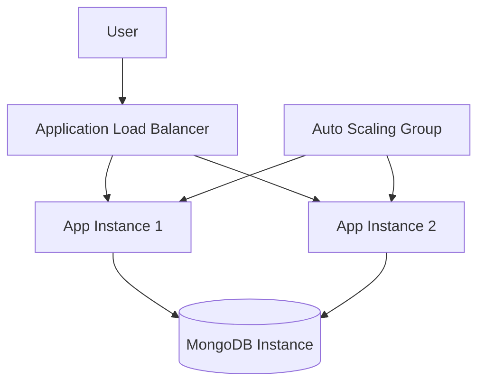
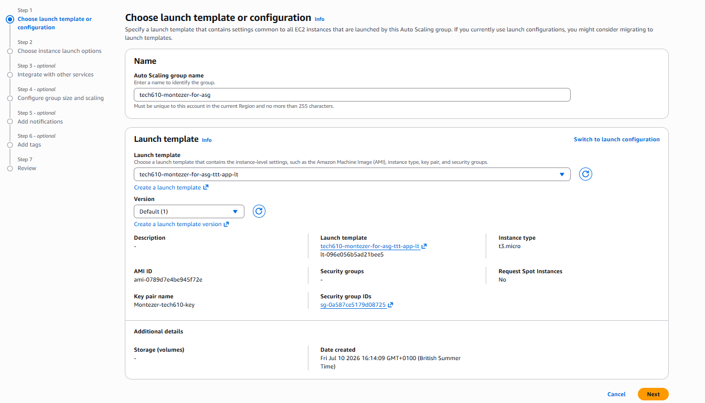
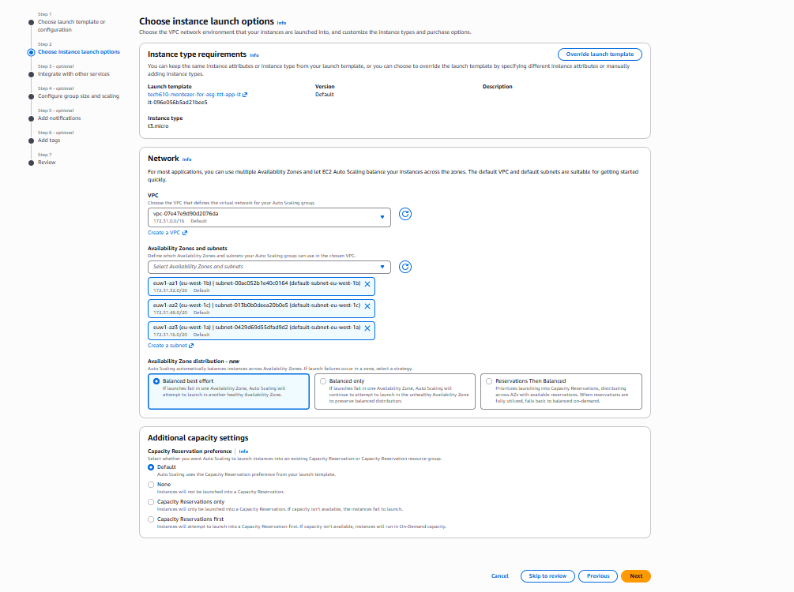
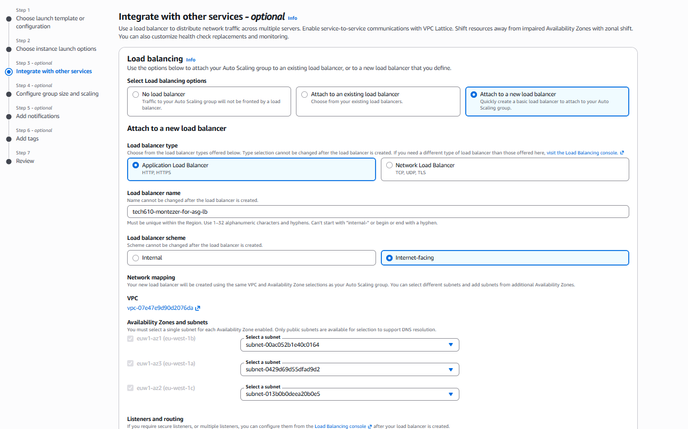
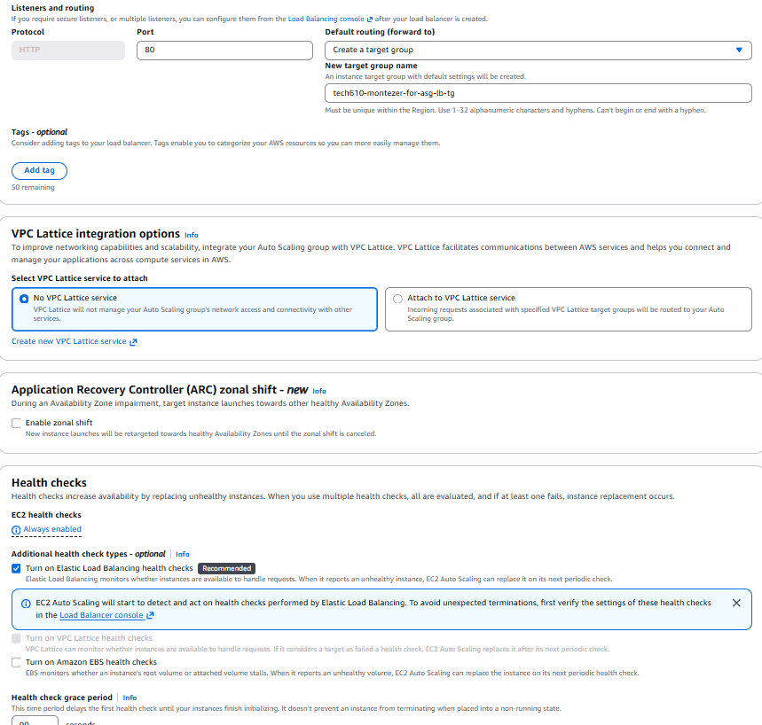
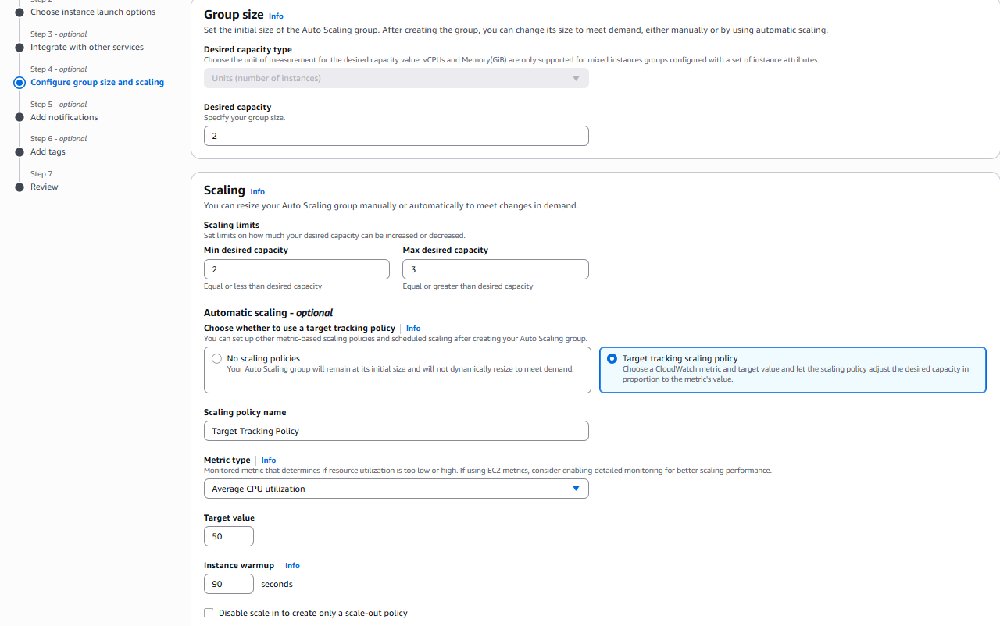
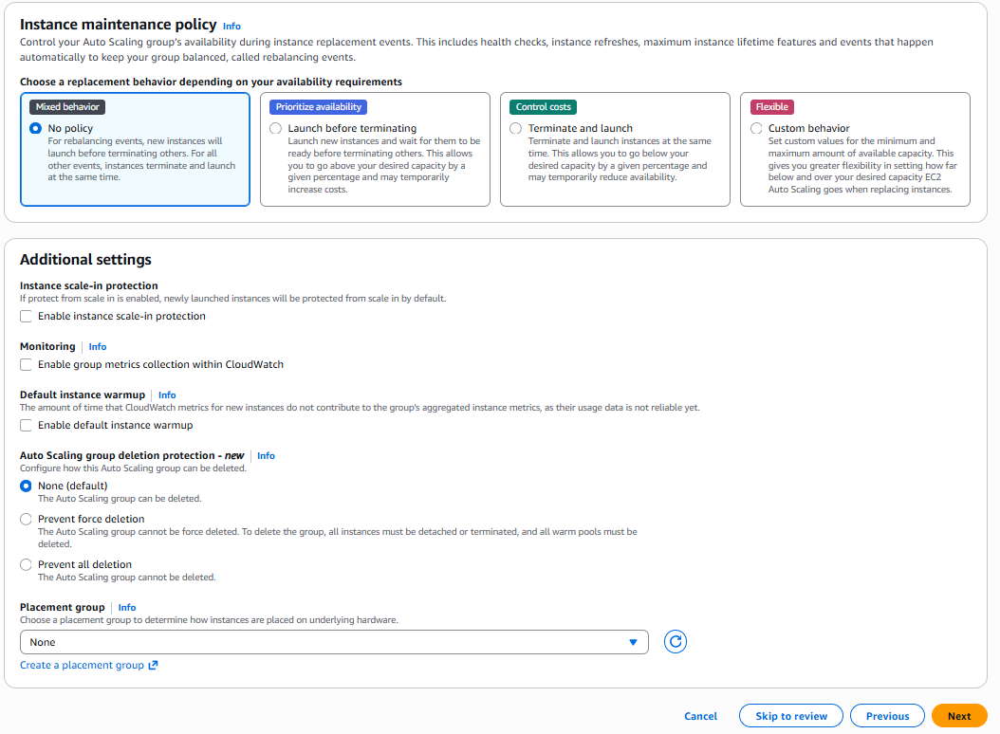

# AWS Auto Scaling Group Setup

## Overview

I recreated an AWS Auto Scaling Group for my application.

The setup included:

- a launch template;
- multiple Availability Zones;
- an Application Load Balancer;
- a target group;
- Elastic Load Balancing health checks;
- a target tracking scaling policy;
- two application instances by default;
- a maximum of three application instances;
- one separate MongoDB EC2 instance.

The Auto Scaling Group scales only the application tier. The MongoDB database remains as one separate EC2 instance.

---

## Architecture



The user accesses the application through the load balancer DNS name.

The load balancer forwards requests to healthy app instances in the target group. The Auto Scaling Group maintains the required number of app instances and can replace unhealthy instances.

All app instances use the same MongoDB database through the `MONGODB_URI` environment variable in the app user data.

---

# Creating the Auto Scaling Group

## Step 1: Choose the launch template

I opened:

```text
EC2 → Auto Scaling Groups → Create Auto Scaling group
```

I entered the following Auto Scaling Group name:

```text
tech610-montezer-for-asg
```

I selected my existing launch template:

```text
tech610-montezer-for-asg-ttt-app-lt
```

The launch template used the following settings:

| Setting | Value |
|---|---|
| Launch template version | Default version 1 |
| Instance type | `t3.micro` |
| AMI ID | `ami-0789d7e4be945f72e` |
| Key pair | `Montezer-tech610-key` |
| Security group ID | `sg-0a587ce5179d08725` |
| Spot instances | No |

The launch template contains the configuration used by every app instance created by the Auto Scaling Group.

This includes the AMI, instance type, security group, SSH key and user data.

The app user data also contains the MongoDB connection string:

```bash
export MONGODB_URI="mongodb://<DB-PRIVATE-IP>:27017/tictactoe"
```

This ensures that every app instance launched by the Auto Scaling Group connects to the same MongoDB VM.



---

## Step 2: Choose the instance launch options

I selected the default VPC:

```text
vpc-07e47e9d90d2076da
```

The VPC used the following IPv4 CIDR range:

```text
172.31.0.0/16
```

I selected three subnets across three Availability Zones:

| Availability Zone | Subnet ID | CIDR range |
|---|---|---|
| `eu-west-1b` | `subnet-00ac052b1e40c0164` | `172.31.32.0/20` |
| `eu-west-1c` | `subnet-013b0b0deea20b0e5` | `172.31.48.0/20` |
| `eu-west-1a` | `subnet-0429d6955dfad9d2` | `172.31.16.0/20` |

Using multiple Availability Zones improves availability.

If one Availability Zone has a problem, the Auto Scaling Group can continue launching and running instances in the other selected zones.

For Availability Zone distribution, I selected:

```text
Balanced best effort
```

The Capacity Reservation preference was left as:

```text
Default
```



---

## Step 3: Create and attach a load balancer

I selected:

```text
Attach to a new load balancer
```

I chose an Application Load Balancer because the application receives HTTP web traffic.

The load balancer configuration was:

| Setting | Value |
|---|---|
| Load balancer type | Application Load Balancer |
| Name | `tech610-montezer-for-asg-lb` |
| Scheme | Internet-facing |
| Protocol | HTTP |
| Listener port | `80` |

The load balancer was created in the same VPC and used public subnets across the selected Availability Zones.



---

## What is a load balancer?

A load balancer provides one public entry point for the application.

Instead of users connecting directly to one EC2 instance, they connect to the load balancer DNS name.

The load balancer then forwards each request to one of the healthy app instances.

The load balancer is needed because instances inside an Auto Scaling Group can be created, replaced and terminated automatically. Their individual public IP addresses may change.

The load balancer provides:

- one consistent DNS name;
- traffic distribution;
- health checks;
- improved availability;
- automatic routing to newly launched instances;
- removal of unhealthy instances from normal traffic.

---

## Listener and target group

The load balancer listener accepts HTTP traffic on port `80`.

It forwards traffic to a new target group named:

```text
tech610-montezer-for-asg-lb-tg
```

The target group contains the application EC2 instances managed by the Auto Scaling Group.

When the Auto Scaling Group launches a new instance, it automatically registers the instance with the target group.

When an instance is terminated, it is automatically removed.

---

## Health checks

I enabled:

```text
Elastic Load Balancing health checks
```

This allows the Auto Scaling Group to use the load balancer health-check results.

The health-check grace period was set to:

```text
90 seconds
```

The grace period gives a newly launched instance time to boot, run its user data, start Nginx, start the Node.js app, connect to MongoDB and register with the target group.

If an instance repeatedly fails its health checks after the grace period, the Auto Scaling Group can mark it as unhealthy and replace it.



---

## Step 4: Configure group size

I configured the following capacity settings:

| Capacity setting | Value |
|---|---:|
| Desired capacity | 2 |
| Minimum desired capacity | 2 |
| Maximum desired capacity | 3 |

The desired capacity is the number of instances the Auto Scaling Group normally tries to maintain.

The minimum capacity of two prevents the application from scaling below two running app instances.

The maximum capacity of three prevents the Auto Scaling Group from launching more than three app instances.

---

## Automatic scaling policy

I selected a target tracking scaling policy.

The policy was configured as:

| Setting | Value |
|---|---|
| Policy type | Target tracking |
| Metric | Average CPU utilisation |
| Target value | 50% |
| Instance warm-up | 90 seconds |

The policy attempts to keep the average CPU utilisation close to 50%.

If CPU usage remains above the target, AWS can increase the desired capacity and launch another app instance.

The group can scale from:

```text
2 app instances → 3 app instances
```

When demand falls, the group can scale back down, but it will not go below the minimum capacity of two.



---

## Step 5: Additional settings

For the instance maintenance policy, I kept:

```text
No policy
```

The following optional settings were left disabled:

| Setting | Selection |
|---|---|
| Instance scale-in protection | Disabled |
| Auto Scaling group metrics collection | Disabled |
| Default instance warm-up | Disabled |
| Auto Scaling group deletion protection | None |
| Placement group | None |

Scale-in protection was not enabled because app instances are intended to be replaceable.

Persistent application data is stored in MongoDB rather than on the local app instance.

Deletion protection was left as `None` so that the Auto Scaling Group could be removed after the task.



---

# Final configuration

| Component | Configuration |
|---|---|
| Auto Scaling Group | `tech610-montezer-for-asg` |
| Launch template | `tech610-montezer-for-asg-ttt-app-lt` |
| Instance type | `t3.micro` |
| Desired capacity | 2 |
| Minimum capacity | 2 |
| Maximum capacity | 3 |
| Availability Zones | `eu-west-1a`, `eu-west-1b`, `eu-west-1c` |
| Load balancer | `tech610-montezer-for-asg-lb` |
| Load balancer type | Application Load Balancer |
| Scheme | Internet-facing |
| Listener | HTTP port 80 |
| Target group | `tech610-montezer-for-asg-lb-tg` |
| Health checks | Elastic Load Balancing health checks |
| Health-check grace period | 90 seconds |
| Scaling metric | Average CPU utilisation |
| CPU target | 50% |
| Instance warm-up | 90 seconds |

---

# Connecting the database

The Auto Scaling Group scales only the app instances.

The MongoDB database runs on one separate EC2 instance.

Each app instance receives the MongoDB connection string through the launch template user data:

```bash
export MONGODB_URI="mongodb://<DB-PRIVATE-IP>:27017/tictactoe"
```

Because every app instance uses the same `MONGODB_URI`, all instances read and write to the same database.

This means:

- data remains available when an app instance is terminated;
- newly launched app instances can access existing data;
- requests can be handled by different app instances without showing different data;
- the MongoDB VM is not duplicated when the app tier scales.

For this temporary training deployment, MongoDB port `27017` was opened for testing. In a production deployment, it should be restricted to the app instances' security group.

---

# Testing the deployment

## Test the load balancer

I copied the Application Load Balancer DNS name and opened it in a browser.

The application loaded successfully through the DNS name.

This confirmed that the listener, target group and healthy app instances were working.

## Test database persistence

To prove that all app instances used the same MongoDB VM:

1. I opened the application through the load balancer DNS name.
2. I created data through the application.
3. I refreshed the page and confirmed that the data remained.
4. I terminated one app instance.
5. The Auto Scaling Group launched a replacement.
6. I waited for the replacement to become healthy.
7. I reopened the application through the DNS name.
8. The original data was still available.

This showed that the data was stored in MongoDB rather than on a disposable app instance.

## Test an unhealthy instance

To make an app instance unhealthy, I could SSH into it and stop Nginx:

```bash
sudo systemctl stop nginx
```

The load balancer health check would fail because the instance would no longer respond successfully on port `80`.

After enough failed health checks, the target would be marked unhealthy.

Because Elastic Load Balancing health checks were enabled for the Auto Scaling Group, AWS could terminate the unhealthy instance and launch a replacement.

To restore the instance before replacement:

```bash
sudo systemctl restart nginx
```

---

# Blocker encountered

## Inconsistent MongoDB connection through the load balancer

While testing the application through the load balancer DNS name, I noticed inconsistent behaviour when refreshing the page.

The application alternated between:

- showing that MongoDB was connected;
- showing that MongoDB was disconnected.

For example:

```text
Refresh 1 → database connected
Refresh 2 → database disconnected
Refresh 3 → database connected
```

This suggests that the load balancer was sending requests to different app instances and that the instances may not have had identical MongoDB connectivity or environment configuration.

One app instance may have been connecting successfully while another app instance was not.

Possible causes include:

- one instance not receiving the correct `MONGODB_URI`;
- user data not completing successfully on one instance;
- PM2 starting without the environment variable;
- one instance failing to reach MongoDB on port `27017`;
- inconsistent launch template or instance configuration.

Due to time constraints, I recorded this as an unresolved blocker and did not complete further troubleshooting.

The Auto Scaling Group, load balancer and application remained operational, but the database connection was not consistent across every request.

### Current status

```text
Auto Scaling Group: Working
Load balancer DNS: Working
Application instances: Running
MongoDB instance: Running
Database connection across all app instances: Inconsistent / unresolved
```

### Suggested future investigation

The next troubleshooting step would be to SSH into each app instance separately and compare:

```bash
pm2 env 0 | grep MONGODB_URI
pm2 logs --lines 50
nc -zv <DB-PRIVATE-IP> 27017
sudo tail -n 100 /var/log/cloud-init-output.log
```

This would help identify which app instance was failing to connect and whether the issue came from user data, PM2 or network connectivity.

---

# Conclusion

The Auto Scaling Group was successfully recreated.

It launched two app instances by default, used an Application Load Balancer to distribute requests and could scale up to three instances based on average CPU utilisation.

The app instances were configured to connect to one shared MongoDB EC2 instance using the `MONGODB_URI` environment variable in user data.

The main Auto Scaling and load-balancing deployment worked successfully. However, database connectivity appeared inconsistent between the app instances, so this was documented as an unresolved blocker for future investigation.
