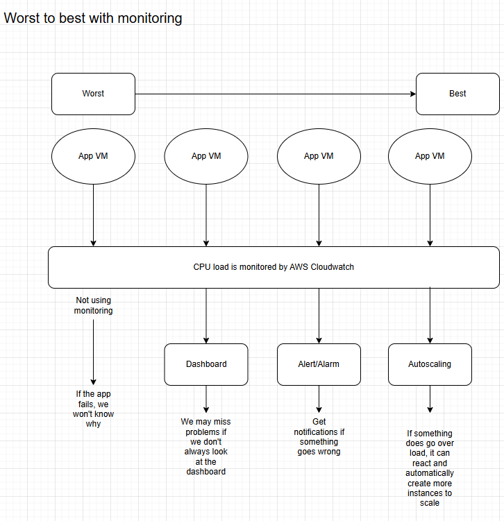
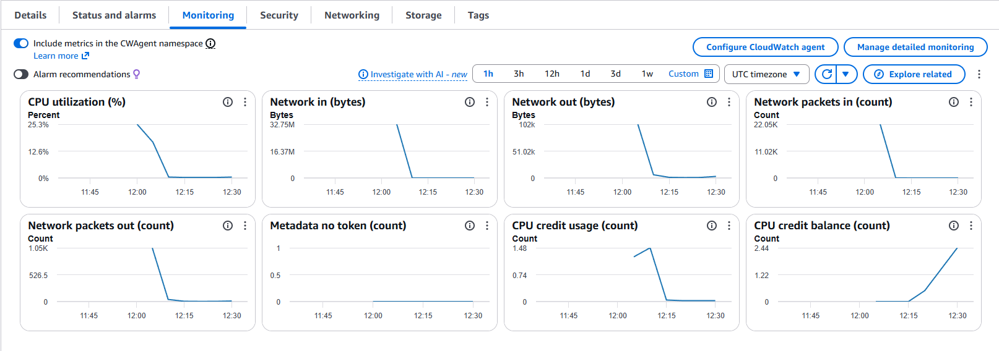
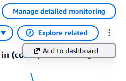
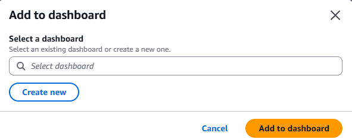
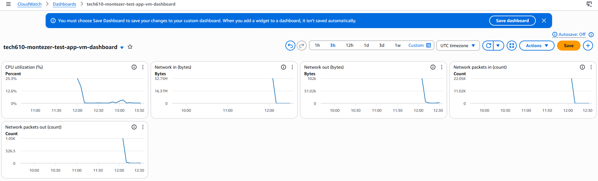
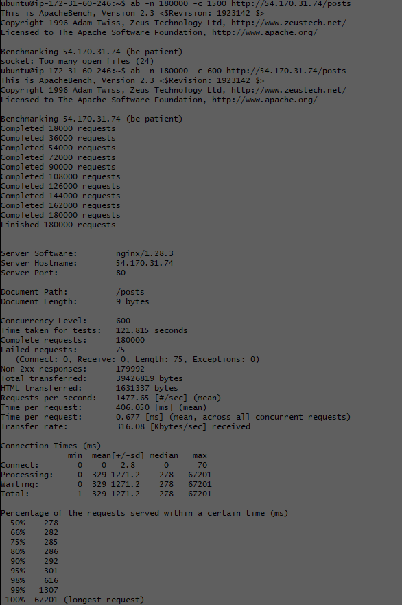
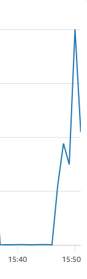
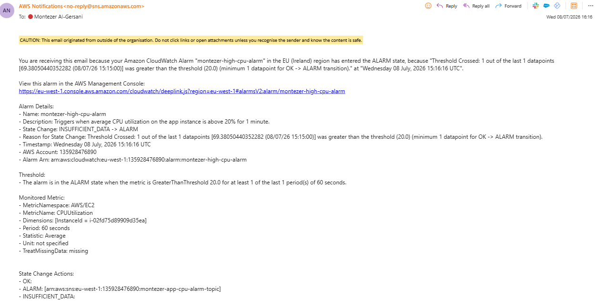

# Monitoring, Alert Management and Autoscaling

## 1a. Performance Testing

Performance testing is used to check whether an application is working well under different conditions.

For this task, the main focus was **load testing**.

Load testing means sending a large amount of traffic to an application to see how it responds. This helps us understand whether the app can handle many users or requests at the same time.

### Tool Used: ApacheBench

ApacheBench, also known as `ab`, was used to send test traffic to the app instance.

### Installing ApacheBench

```bash
sudo apt update -y
sudo apt install apache2-utils -y
```

### ApacheBench Command Format

```bash
ab -n 1000 -c 100 http://yourwebsite.com/
```

* `-n` = total number of requests
* `-c` = number of concurrent requests
* URL = the app public IP or app route being tested

### Example Load Testing Commands

```bash
ab -n 1000 -c 100 http://54.170.31.74/
```

```bash
ab -n 10000 -c 200 http://54.170.31.74/
```

```bash
ab -n 20000 -c 300 http://54.170.31.74/
```

---

## 1b. Monitoring and Alert Management



Monitoring helps us understand how an application or server is performing. It gives visibility into metrics such as CPU usage, network traffic and whether the instance is healthy.

### 1. No Monitoring

This is the worst setup.

If the application fails, we may not know why it failed. We may only find out when users complain or when someone manually checks the server.

Problems with no monitoring:

* No visibility into CPU usage
* No alerts when something goes wrong
* Harder to troubleshoot failures
* Slower response to incidents

### 2. Dashboard

A dashboard allows us to view metrics visually.

For example, we can use a CloudWatch dashboard to see CPU usage over time.

This is useful because it helps us understand the health and performance of the VM. However, dashboards have a limitation: someone has to actively look at them. If nobody checks the dashboard, problems may still be missed.

### 3. Alert / Alarm

An alert or alarm improves monitoring because it notifies us when something goes wrong.

For example, we can create a CloudWatch alarm that triggers when CPU usage goes above a certain threshold.

Example:

```text
If CPU usage is above 80% for 5 minutes, send a notification.
```

This means we do not have to constantly watch the dashboard.

### 4. Autoscaling

Autoscaling is the best option shown in the diagram.

If CPU load becomes too high, AWS can automatically launch more app VM instances to handle the increased traffic.

This makes the application more reliable because the system can react automatically instead of waiting for a human to fix the problem.

### Summary: Worst to Best

1. No monitoring
2. Dashboard
3. Alert / Alarm
4. Autoscaling

Monitoring helps us detect issues, understand performance, and respond faster. A dashboard gives visibility, alarms provide notifications, and autoscaling allows AWS to react automatically when demand increases.

---

## Dashboard Setup

### Step 1

On the instance details page of the app instance, scroll down to the **Monitoring** tab.



### Step 2

Click the three dots in the monitoring section and choose **Add to dashboard**.



### Step 3

Create a new dashboard with a clear name, for example:

```text
tech610-montezer-test-app-vm-dashboard
```



### Step 4

After creating the dashboard, click **Add to dashboard**. This opens the CloudWatch dashboard page.



---

## 1c. How Load Testing and the Dashboard Helped

Load testing created artificial traffic against the app, while the dashboard showed how the app instance responded.

This helped us:

* see CPU usage increase during traffic spikes
* check whether the app stayed responsive
* confirm that the monitoring dashboard was working
* understand when the instance was under heavy load
* test when an alert should be triggered

This was useful because monitoring is only valuable if it helps us understand the health of the system. Load testing created the pressure, and the dashboard showed the impact of that pressure.

---

## 1d. Load Testing Results

After running the following ApacheBench command, the terminal showed the result of the load test:

```bash
ab -n 180000 -c 600 http://54.170.31.74/
```

The app became slow, but I could not get it to fully stop responding.



The load test caused a spike in CPU usage, which was visible on the CloudWatch dashboard.



---

# Creating a CPU Usage Alarm for the App Instance

To monitor the app instance, I created a CloudWatch alarm for CPU utilisation. The purpose of the alarm was to send an email notification when the app instance CPU usage became too high during load testing.

## Steps

1. Opened the AWS Console and went to **CloudWatch**.
2. Selected **Alarms** and then **Create alarm**.
3. Chose **Select metric**.
4. Selected **EC2 → Per-Instance Metrics**.
5. Found the app instance and selected the **CPUUtilization** metric.
6. Set the statistic to **Average**.
7. Set the period to **1 minute** so the alarm checked the average CPU usage every minute.
8. Set the condition to trigger when CPU utilisation was greater than the chosen threshold.
9. Created or selected an SNS topic for notifications.
10. Added my email address as the notification endpoint.
11. Confirmed the SNS subscription from the email sent by AWS.
12. Created the alarm and then used ApacheBench to generate load on the app.

## Alarm Configuration

| Setting           | Value            |
| ----------------- | ---------------- |
| Metric            | CPUUtilization   |
| Instance          | App instance     |
| Statistic         | Average          |
| Period            | 1 minute         |
| Threshold         | Greater than 20% |
| Evaluation period | 1 out of 1       |
| Notification      | SNS email topic  |

## Testing the Alarm

To trigger the alarm, I used ApacheBench to send a large number of requests to the app:

```bash
ab -n 120000 -c 400 http://54.170.31.74/posts
```

This generated artificial traffic against the app instance. The CloudWatch dashboard showed CPU utilisation increasing, and the alarm changed state when the average CPU usage went above the threshold.

The alarm email showed that the app instance reached **69.38% CPU utilisation**, which was greater than the **20% threshold**. The alarm checked the **average CPU usage over a 60 second period**, which met the requirement to check the average for each minute.



---

## Cleanup

After completing the monitoring and alerting task, I cleaned up the AWS resources to avoid unnecessary costs.

### Cleanup Steps

1. Stopped the ApacheBench load test if it was still running.
2. Terminated the app EC2 instance.
3. Terminated any extra test or load-testing EC2 instances.
4. Deleted the CloudWatch dashboard.
5. Deleted the CloudWatch CPU alarm.
6. Deleted the SNS topic used for email notifications.
7. Checked the EC2 console to make sure no unused instances were still running.

Cleaning up is important because CloudWatch dashboards, alarms, SNS topics and EC2 instances can continue to exist after testing. Removing them avoids unnecessary resource usage and possible AWS costs.
